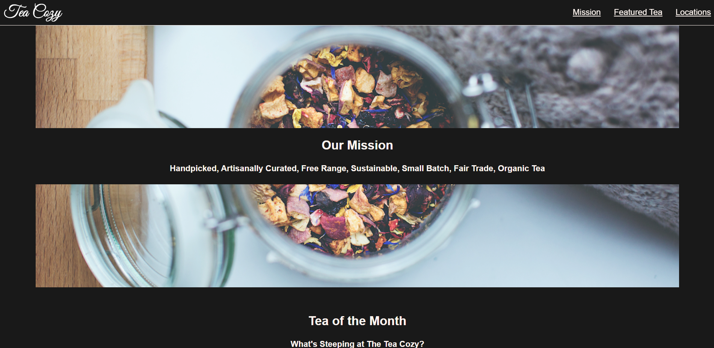

# Tea Cozy Website

## Description

## **_Note: This is a project from codecademy_**.

A website made for Tea Enthusiasists, this project is to showcase the ability to re-create a website from a design example

### Preview
<!-- you can't have spaces in your preview image btw -->

<!-- One way to do it -->
<!--  -->

<!-- another way (and you can set width) -->

### Languages used

-   HTML
-   CSS

##### Note

-   I do not hold any copyrights
